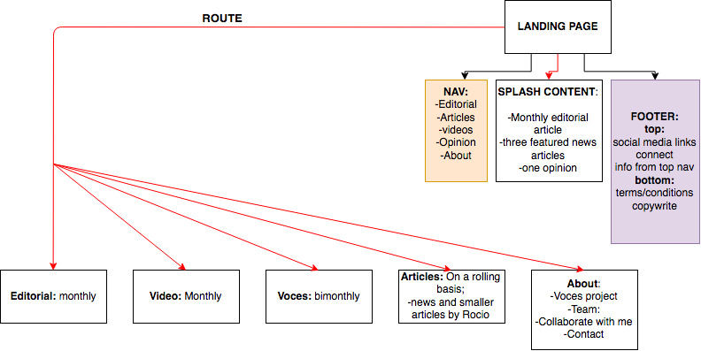

# Voces

#### _Capstone Project , 07.19.2019_

#### By _Brooke Kullberg_

## Project Proposal

_Project’s Purpose or Goal:_ 

_This website will be the home of a project called ‘Voces’ by Rocio Rios. She’s a journalist with the goal of writing about hispanic and immigrant voices, issues and concerns in the community, beginning with an Oregon scope, but as the project grows, scaling to National coverage._

_The absolute minimum features the project requires to meet this purpose or goal:_

* _Website written in Spanish including: landing page, pages for articles, editorials, videos, letters to editor, about._
* _Being able to leave comments, share on social media._
* _Website in spanish that translates to english, or other languages.
* _Connection to an SQL database._

_The tools, frameworks, libraries, APIs, modules and/or other resources for the MVP?_

* _MySql database with a C#/ASP.NetCore/EFCore back-end._
* _React, Redux and Typescript front-end._
* _https://www.i18next.com/ : library to translate webpages._
* _https://www.shareapi.com/: api to share via social media._
* _Scrollspy: https://medium.com/front-end-weekly/anatomy-of-a-scrollspy-component-with-react-and-typescript-1-2-c04f9d5c9bad_
* _sticky components: https://github.com/captivationsoftware/react-sticky_

_Goals and features to develop after achieving MVP:_

* _An Admin section twith CRUD functionality._
* _Authorization._
* _Universal design: achieving accessibility._ 
* _Media Queries: design for mobile use._
* _Form to take in emails for be on mailing list._

Additional tools, frameworks, libraries, APIs, or other resources for the additional features beyond MVP?

* _https://oauth.net/2/ : OAuth._

## Project Component Tree

  

